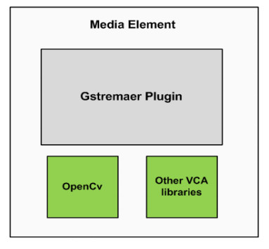

.. _architecture:	     
	     
%%%%%%%%%%%%
Architecture
%%%%%%%%%%%%

On this section, we give an overview of the NUBOMEDIA architecture, with special
emphasis on the part of computer vision.

Let's start with a simple explanation of what NUBOMEDIA is. Imagine a media
communication using skype. But instead of using Skype, this time we use web
browsers, through a PC, table or mobile phone. Now, in the middle of this
communication We can introduce different boxes or filters. This boxes or
filters have a specific funcionality. In particular, such funcionality is
related to media capabilities such as encryption, transcoding, computer vision
and augmented reality.

At this point, we can differenciate two parts the client part which  runs in the
browser and the cloud part running over OpenStack which has the logic of the
application and is capeable of creating the  different filters (multimedia
capabilities) in the cloud with the specific funcionalities and establish the
corresponding communications among the filters. Therefore we can distinguish
three different modules:

- **Client Application**: which involves the native multimedia capabilities of
  the browser plus the specific client-side application logic.

- **Application Server (AS)**: which runs on the cloud and  contains the
  server-side application logic.

- **Media Server (MS)**: which runs on the cloud and is responsible for
  receiving commands for creating specific filters.

.. image:: images/browsers.jpg
   :alt:    VCA filters for NUBOMEDIA
   :align:  center
   :width:  480

The main technologies used for this architecture are:
`OpenStack <https://www.openstack.org>`__, `Kurento <http://www.kurento.org>`__
and different techniques that make it possible  to develop the different
features of the filters.

From now on, we will focus on the part of computer vision. The different
computer vision filters are integrated in NUBOMEDIA through the
**Media Elements (ME)**. These media elements are created by the Media Server
(MS). The media elements are monolithic and abstractions elements which send
and receive media streams and data through different protocols. The goal of
these elements is to carry out specific processing of the media stream or the
data. Specifically, the VCA media elements are focused on  applying VCA
algorithms in order to extract valuable semantic information.

Now, we are going to see how to integrate these algorithms and how to  process
the video and data. The Media Elements offer the possibility to develop a
specific algorithm through a GStreamer plugin. These plugins offer to the
developers the video, frame by frame in a specific function. Therefore, the
user can perform the  processing of the frame in this function. With the aim to
process every frame the developers can use different libraries. On this project
a high percentage of the  algorithms are going to be developed using the
**OpenCV** library. On the other hand, an important percentage of the
algorithms are going to be developed using other libraries. In the following
figure we can see the different modules used to develop  VCA filters contained
on the media elements.

Finally, once the algorithm has been developed and installed, the developers can
use the filter using the Java or JavaScript API.
