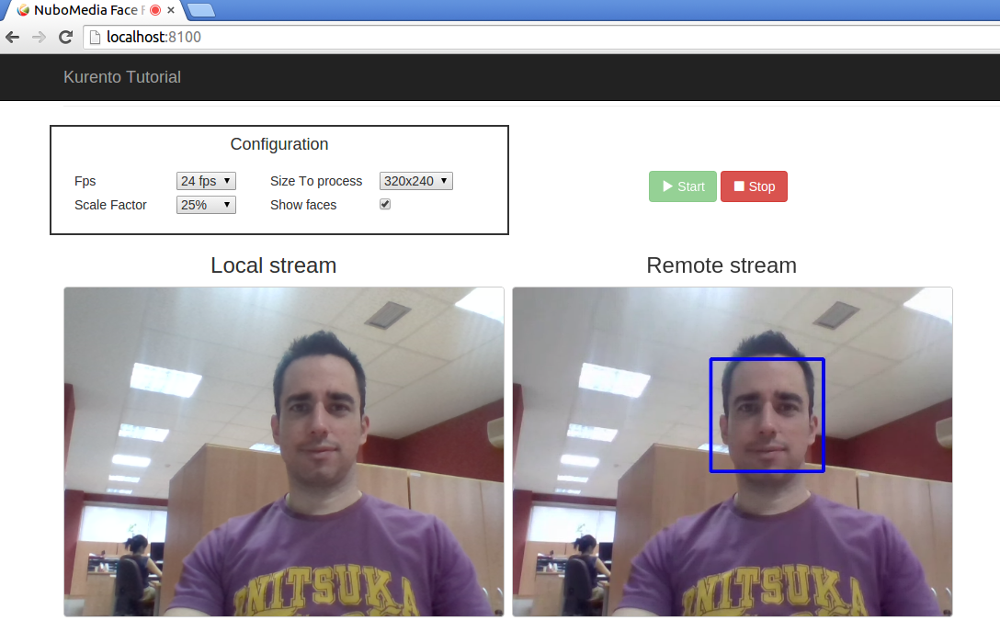
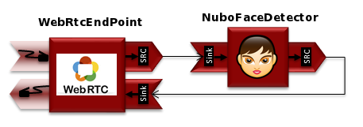

.. _face_detector:	     
	     
%%%%%%%%%%%%%
Face Detector
%%%%%%%%%%%%%

This web application  consists on a WebRTC video communication with a face
detector filter (loopback, the media stream going from client to the media
server and back to client).

Compiling & Running
===================

This section explain how to compile and run the demo in a local environment. To
install the neccesary software please see the
:doc:`installation guide <installation_guide>`. To compile you have to options:

- To compile everything as it has been explained on the
  :doc:`installation guide <installation_guide>`
- To compile only this module. Again, here we have two different options

.. sourcecode:: console

   cd apps/NuboFaceJava
   --First option
   sh generate_zip.sh

   --Second option
   mvn package

If we follow the steps explained on the
:doc:`installation guide <installation_guide>` , once we restart the media
server through the command bellow or reboot the computer, we can test the
application accesing the following URL: **localhost:8100**

.. sourcecode:: console

   sudo /etc/init.d/kurento-media-server restart

For the second option, we can run the aplication through the following  command.
At this time, the url for accesing the application is: **localhost:8080**

.. sourcecode:: console

   java -jar target/NuboFaceJava*.jar

Understanding this example
==========================
The following figure shows a screenshoot of this demo running.

The interface of the application (an HTML web page) is composed by two HTML5
video tags: one showing the local stream (as captured by the device webcam) and
the other showing the remote stream sent by the media server back to the
client. The video camera stream is sent to Kurento Media Server, which
processes and sends it back to the client as a remote stream. To implement
this, we need to create a Media Pipeline composed by the following Media
Elements:

This is a web application, and therefore it follows a client-server
architecture. At the client-side, the logic is implemented in JavaScript. At
the server-side we use a Java EE application server consuming a  Client API to
control the  Media Server capabilities. To communicate these entities, two
WebSockets are used. First, a WebSocket is created between client and
application server to implement a custom signaling protocol. Second, another
WebSocket is used to perform the communication between the Java Client and the 
Media Server. To communicate the client with the Java EE application server the
platform uses a simple signaling protocol based on JSON messages over
WebSocket‘s. SDP and ICE candidates needs to be exchanged between client and
server to establish the WebRtc session. If you are interested on knowing more
about the messages exchanged between them, have a look to this
`example <http://www.kurento.org/docs/current/tutorials/java/tutorial-2-magicmirror.html>`__
.

Application Server Side
=======================

This demo has been developed using a Java EE application server based on the
Spring Boot framework. This technology can be used to embed the Tomcat web
server in the application and thus simplify the development process.

In the following figure you can see a class diagram of the server side code:

.. image:: images/FaceJavaClass.png
   :alt:    face detector class diagram
   :align:  center
   :width:  480

The main class of this demo is named NuboFaceJavaApp. As you can see, the
NuboMediaClient is instantiated in this class as a Spring Bean. This bean is
used to create  Media Pipelines, which are used to add media capabilities to
your applications. In this instantiation we see that we need to specify to the
client library the location of the Kurento Media Server. In this example, we
assume it’s located at localhost listening in port 8888. If you reproduce this
tutorial you’ll need to insert the specific location of your Kurento Media
Server instance there.

.. sourcecode:: java 

	@Configuration
	@EnableWebSocket
	@EnableAutoConfiguration
	public class NuboFaceJavaApp implements WebSocketConfigurer {

	 final static String DEFAULT_KMS_WS_URI = "ws://localhost:8888/kurento";

	 @Bean
	 public NuboFaceJavaHandler handler() {
	  return new NuboFaceJavaHandler();
	 }

	 @Bean
	 public KurentoClient kurentoClient() {
	  return KurentoClient.create(System.getProperty("kms.ws.uri",
	   DEFAULT_KMS_WS_URI));
	 }

	 @Override
	 public void registerWebSocketHandlers(WebSocketHandlerRegistry registry) {
	  registry.addHandler(handler(), "/nubofacedetector");
	 }

	 public static void main(String[] args) throws Exception {
	  new SpringApplication(NuboFaceJavaApp.class).run(args);
	 }
	}

This web application follows Single Page Application architecture and uses a
WebSocket to communicate client with application server by means of requests
and responses. Specifically, the main app class implements the interface
WebSocketConfigurer to register a WebSocketHanlder to process WebSocket
requests in the path /nubofacedetector.

NuboFaceJavaHandler class implements TextWebSocketHandler to handle text
WebSocket requests. The central piece of this class is the method
handleTextMessage. This method implements the actions for requests, returning
responses through the WebSocket. In other words, it implements the server part
of the signaling protocol depicted.

In the designed protocol there are three different kinds of incoming messages to
the Server: start, show_faces, scale_factor, process_num_frames,
width_to_process,  stop and onIceCandidates. These messages are treated in the
switch clause, taking the proper steps in each case.

.. sourcecode:: java

	public class NuboFaceJavaHandler extends TextWebSocketHandler {

	 @Override
	 public void handleTextMessage(WebSocketSession session, TextMessage message)
	 throws Exception {
	  JsonObject jsonMessage = gson.fromJson(message.getPayload(),
	   JsonObject.class);

	  log.debug("Incoming message: {}", jsonMessage);

	  switch (jsonMessage.get("id").getAsString()) {
	   case "start":
	    start(session, jsonMessage);
	    break;
	   case "show_faces":
	    setVisualization(session, jsonMessage);
	    break;
	   case "scale_factor":
	    log.debug("Case scale factor");
	    setScaleFactor(session, jsonMessage);
	    break;
	   case "process_num_frames":
	    log.debug("Case process num frames");
	    setProcessNumberFrames(session, jsonMessage);
	    break;
	   case "width_to_process":
	    log.debug("Case width to process");
	    setWidthToProcess(session, jsonMessage);
	    break;

	   case "stop":
	    {
	     UserSession user = users.remove(session.getId());
	     if (user != null) {
	      user.release();
	     }
	     break;
	    }
	   case "onIceCandidate":
	    {
	     JsonObject candidate = jsonMessage.get("candidate")
	     .getAsJsonObject();

	     UserSession user = users.get(session.getId());
	     if (user != null) {
	      IceCandidate cand = new IceCandidate(candidate.get("candidate")
	       .getAsString(), candidate.get("sdpMid").getAsString(),
	       candidate.get("sdpMLineIndex").getAsInt());
	      user.addCandidate(cand);
	     }
	     break;
	    }

	   default:
	    sendError(session,
	     "Invalid message with id " + jsonMessage.get("id").getAsString());
	    break;
	  }
	 }

	 private void start(WebSocketSession session, JsonObject jsonMessage) {
	  ...
	 }

	 private void sendError(WebSocketSession session, String message) {
	   ...
	  }
	  ...
	}

In the following snippet, we can see the start method. It handles the ICE
candidates gathering, creates a Media Pipeline, creates the Media Elements
(WebRtcEndpoint and NuboFaceDetectorFilter) and make the connections among
them. A startResponse message is sent back to the client with the SDP answer.

.. sourcecode:: java

	private void start(final WebSocketSession session, JsonObject jsonMessage) {
	 try {
	  // Media Logic (Media Pipeline and Elements)
	  UserSession user = new UserSession();
	  MediaPipeline pipeline = kurento.createMediaPipeline();
	  user.setMediaPipeline(pipeline);
	  webRtcEndpoint = new WebRtcEndpoint.Builder(pipeline).build();
	  user.setWebRtcEndpoint(webRtcEndpoint);
	  users.put(session.getId(), user);

	  webRtcEndpoint
	   .addOnIceCandidateListener(new EventListener < OnIceCandidateEvent > () {

	    @Override
	    public void onEvent(OnIceCandidateEvent event) {
	     JsonObject response = new JsonObject();
	     response.addProperty("id", "iceCandidate");
	     response.add("candidate", JsonUtils
	      .toJsonObject(event.getCandidate()));
	     try {
	      synchronized(session) {
	       session.sendMessage(new TextMessage(
		response.toString()));
	      }
	     } catch (IOException e) {
	      log.debug(e.getMessage());
	     }
	    }
	   });

	  face = new NuboFaceDetector.Builder(pipeline).build();
	  webRtcEndpoint.connect(face);
	  face.connect(webRtcEndpoint);

	  // SDP negotiation (offer and answer)
	  String sdpOffer = jsonMessage.get("sdpOffer").getAsString();
	  String sdpAnswer = webRtcEndpoint.processOffer(sdpOffer);

	  // Sending response back to client
	  JsonObject response = new JsonObject();
	  response.addProperty("id", "startResponse");
	  response.addProperty("sdpAnswer", sdpAnswer);

	  synchronized(session) {
	   session.sendMessage(new TextMessage(response.toString()));
	  }
	  webRtcEndpoint.gatherCandidates();

	 } catch (Throwable t) {
	  sendError(session, t.getMessage());
	 }
	}

The sendError method is quite simple: it sends an error message to the client
when an exception is caught in the server-side.

.. sourcecode:: java

	 private void sendError(WebSocketSession session, String message) {
	  try {
	   JsonObject response = new JsonObject();
	   response.addProperty("id", "error");
	   response.addProperty("message", message);
	   session.sendMessage(new TextMessage(response.toString()));
	  } catch (IOException e) {
	   log.error("Exception sending message", e);
	  }
	 }

Application Client Side
=======================

Let’s move now to the client-side of the application. To call the previously
created WebSocket service in the server-side, we use the JavaScript class
WebSocket. We use an specific JavaScript library called kurento-utils.js to
simplify the WebRTC interaction with the server. This library depends on
adapter.js, which is a JavaScript WebRTC utility maintained by Google that
abstracts away browser differences. Finally jquery.js is also needed in this
application.

These libraries are linked in the index.html web page, and are used in the
index.js. In the following snippet we can see the creation of the WebSocket
(variable ws) in the path /nubofacedetector. Then, the onmessage listener of
the WebSocket is used to implement the JSON signaling protocol in the
client-side. Notice that there are three incoming messages to client:
startResponse, error, and iceCandidate. Convenient actions are taken to
implement each step in the communication. For example, in functions start the
function WebRtcPeer.WebRtcPeerSendrecv of kurento-utils.js is used to start a
WebRTC communication.

.. sourcecode:: javascript

	var ws = new WebSocket('ws://' + location.host + '/nubofacedetector');

	ws.onmessage = function(message) {
	 var parsedMessage = JSON.parse(message.data);
	 console.info('Received message: ' + message.data);

	 switch (parsedMessage.id) {
	  case 'startResponse':
	   startResponse(parsedMessage);
	   break;

	  case 'iceCandidate':
	   webRtcPeer.addIceCandidate(parsedMessage.candidate, function(error) {
	    if (!error) return;
	    console.error("Error adding candidate: " + error);
	   });
	   break;

	  case 'error':
	   if (state == I_AM_STARTING) {
	    setState(I_CAN_START);
	   }
	   onError("Error message from server: " + parsedMessage.message);
	   break;
	  default:
	   if (state == I_AM_STARTING) {
	    setState(I_CAN_START);
	   }
	   onError('Unrecognized message', parsedMessage);
	 }
	}

	function start() {
	 console.log("Starting video call ...")
	  // Disable start button
	 setState(I_AM_STARTING);
	 showSpinner(videoInput, videoOutput);

	 console.log("Creating WebRtcPeer and generating local sdp offer ...");
	 var options = {
	  localVideo: videoInput,
	  remoteVideo: videoOutput,
	  onicecandidate: onIceCandidate
	 }

	 webRtcPeer = new kurentoUtils.WebRtcPeer.WebRtcPeerSendrecv(options,
	  function(error) {
	   if (error) {
	    return console.error(error);
	   }
	   webRtcPeer.generateOffer(onOffer);
	  });
	}

	function onOffer(error, offerSdp) {
	 if (error) return console.error("Error generating the offer");
	 console.info('Invoking SDP offer callback function ' + location.host);
	 var message = {
	  id: 'start',
	  sdpOffer: offerSdp
	 }
	 sendMessage(message);
	}

	function onIceCandidate(candidate) {
	 console.log("Local candidate" + JSON.stringify(candidate));

	 var message = {
	  id: 'onIceCandidate',
	  candidate: candidate
	 };
	 sendMessage(message);
	}

Dependencies
============

This Java Spring application is implemented using Maven. The relevant part of
the pom.xml is where NUBOMEDIA dependencies are declared.  we need  two
dependencies: the Client Java dependency (kurento-client) and the JavaScript
Kurento  utility library (kurento-utils) for the client-side.

.. sourcecode:: xml 

   <dependencies> 
      <dependency>
         <groupId>org.kurento</groupId>
         <artifactId>kurento-client</artifactId>
      </dependency> 
      <dependency> 
         <groupId>org.kurento</groupId>
         <artifactId>kurento-utils-js</artifactId>
      </dependency> 
   </dependencies>

.. note::

   We are in active development. You can find the latest version of
   Kurento Java Client at `Maven Central <http://search.maven.org/#search%7Cga%7C1%7Ckurento-client>`_.

Kurento Java Client has a minimum requirement of **Java 7**. To configure the
application to use Java 7, we have to include the following properties in the
properties section:

.. sourcecode:: xml 

   <maven.compiler.target>1.7</maven.compiler.target>
   <maven.compiler.source>1.7</maven.compiler.source>

Browser dependencies (i.e. *bootstrap*, *ekko-lightbox*, and *adapter.js*) are
handled with `Bower <http://bower.io/>`_. This dependencies are defined in the
file bower.json  The command ``bower install`` is automatically called from
Maven. Thus, Bower should be present in your system. It can be installed in an
Ubuntu machine as follows:

.. sourcecode:: sh

   curl -sL https://deb.nodesource.com/setup_4.x | sudo bash -
   sudo apt-get install -y nodejs
   sudo npm install -g bower
